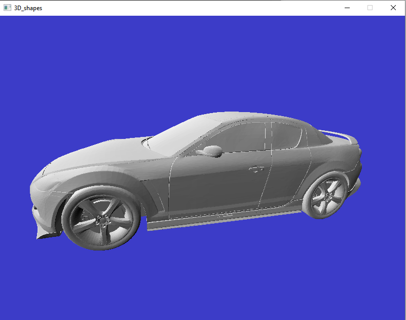

# 3D_shapes

*example of program output*

## Overview
A 3d rasterisation renderer with isometric projection. Contains the following components:
   * Implementation of Graphical primitives like Vectors, vertices, polygons.
   * Implementation of isometric projection with z buffer.
   * Implementation of simple diffuse lighting model.
   * Implementation of rasterisation using 4 dimensional vectors.
   * Interface with the Operating System pixel buffer using sdl2 library.
   * Basic user input with camera controller.
 
 ## Build Steps
   * msbuild 3D_shapes.sln
 
 ## Possible Future Directions
   * Multi threaded CPU based rendering
   * Interface with OpenGL for GPU based rendering
   * Phong lighting model
   * Textures
   * Anti aliasing
